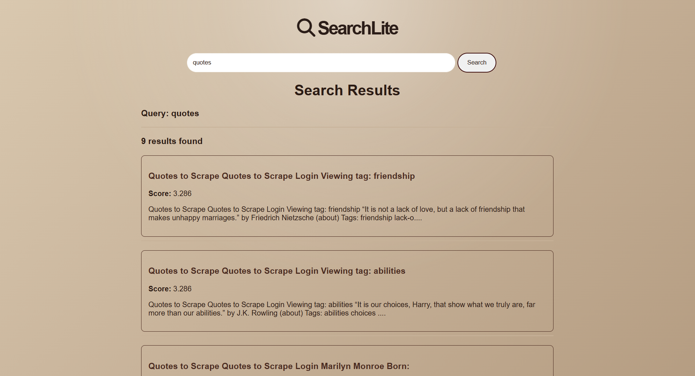

#  Mini Search Engine

A full-pipeline search engine built from scratch in Python — featuring a web crawler, inverted index, TF-IDF ranking, and a Flask-powered search interface. No external search libraries used.

---

##  Preview

| Search Page | Results Page |
|-------------|-------------|
|  |  |


---

##  Features

-  **Web Crawler** — crawls and collects pages from a list of seed URLs
-  **Text Extraction** — extracts and cleans raw text content from crawled HTML pages
-  **Inverted Index** — builds a word-to-page mapping and persists it as JSON
-  **TF-IDF Ranking** — scores and ranks results using Term Frequency-Inverse Document Frequency, implemented from scratch
-  **Boolean AND Search** — returns only pages containing all query words
-  **Flask Web Interface** — clean search page and ranked results page
-  **Fast Querying** — index is pre-built and loaded at runtime for instant lookups

---

##  Tech Stack

| Technology | Usage |
|------------|-------|
| Python | Core logic — crawling, indexing, ranking |
| Flask | Web server and routing |
| HTML/CSS | Frontend search and results interface |
| JSON | Persistent storage for index and page data |
| math (stdlib) | TF-IDF score computation |
| re (stdlib) | Text tokenisation |

---

##  How It Works

### Full Pipeline

```
URLs (urls.txt)
     ↓
Crawler (crawler.py)
     ↓
Text Extractor (extract_text.py)
     ↓
Index Builder (build_index.py) → index.json + pages.json
     ↓
Search Engine (search_engine.py) — TF-IDF ranking
     ↓
Flask App (app.py) — serves results to user
```

### 1. Crawling
`crawler.py` reads seed URLs from `urls.txt` and fetches page content, storing raw data for processing.

### 2. Text Extraction
`extract_text.py` cleans and extracts meaningful text from raw HTML, preparing it for indexing.

### 3. Index Building
`build_index.py` tokenises page content and builds an **inverted index** — a mapping of every unique word to the list of page IDs it appears in. Persisted to `index.json`.

### 4. TF-IDF Ranking
`search_engine.py` scores each candidate page using:

```
TF-IDF(word, page) = TF(word, page) × IDF(word)

where:
  TF  = count of word in page
  IDF = log((N + 1) / (df + 1)) + 1
  N   = total number of pages
  df  = number of pages containing the word
```

Pages are ranked by their **total TF-IDF score** across all query words.

### 5. Boolean AND Filter
Only pages containing **all query words** are considered as candidates before scoring — ensuring high relevance results.

---

## 🚀 Getting Started

### Prerequisites
```bash
pip install flask
```

### Step 1 — Crawl pages
```bash
python crawler.py
```

### Step 2 — Extract text
```bash
python extract_text.py
```

### Step 3 — Build the index
```bash
python build_index.py
```

### Step 4 — Run the app
```bash
python app.py
```

Open `http://localhost:5000` in your browser.

---

##  Project Structure

```
mini-search-engine/
│
├── app.py               # Flask web server
├── crawler.py           # Web crawler
├── extract_text.py      # HTML text extractor
├── build_index.py       # Inverted index builder
├── search_engine.py     # TF-IDF ranking + search logic
├── urls.txt             # Seed URLs for crawling
│
├── index.json           # Inverted index (word → page IDs)
├── pages.json           # Page store (content + URLs)
│
├── /static
│   └── style.css
│
├── /templates
│   ├── index.html       # Search page
│   └── results.html     # Results page
│── /screenshots
└── README.md
```

---

##  Sample Output

```
Total unique words: 18,432

"love"    → [2, 5, 11, 34, ...]
"romance" → [5, 11, 45, ...]
"dog"     → [3, 19, 72, ...]
```

Results returned per query:
```json
{
  "title": "Page Title",
  "url": "https://example.com/page",
  "score": 12.847,
  "preview": "...relevant excerpt from the page content..."
}
```

---

##  Possible Extensions

- Stemming/lemmatization for better token matching
- PageRank-style link analysis
- Multi-word phrase search
- Search result pagination
- Query autocomplete

---

## 🙌 Acknowledgements

Built to understand:
- Information retrieval fundamentals
- TF-IDF ranking from first principles
- Inverted index construction and querying
- Full-stack Python web development with Flask